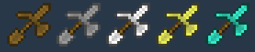
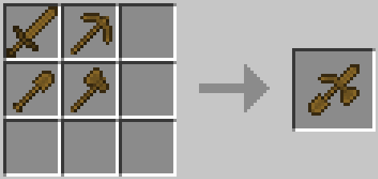
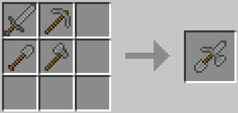
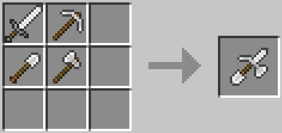
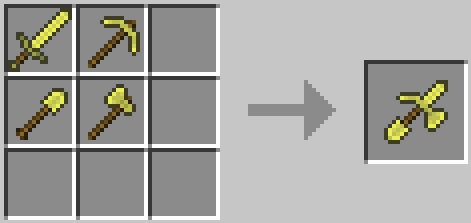
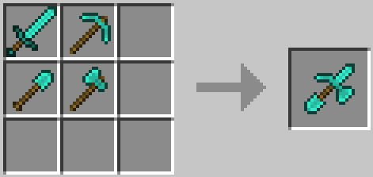

# M2Paxel

[GitHub](https://github.com/Meatwo310/m2paxel) | [CurseForge](https://www.curseforge.com/minecraft/mc-mods/m2paxel) | [Modrinth](https://modrinth.com/mod/m2paxel)



---

[English](#english) | [日本語](#日本語)

## English

### Overview

M2Paxel is a mod that adds "Paxel" - a multi-tool combining Sword, Pickaxe, Axe, and Shovel - to free up hotbar space in Minecraft 1.7.10.

### Features

- **5 Types of Paxels**: Available in wood, stone, iron, gold, and diamond
- **Multi-tool Functionality**: Combines sword, pickaxe, axe, and shovel capabilities
- **Extended Durability**: 4x the durability of standard tools
- **Vanilla-like Experience**: Works just like regular Minecraft tools

### Added Items

| Item Name     | Material    | Harvest Level | Durability |
|---------------|-------------|--------------:|-----------:|
| Wooden Paxel  | Wood        |             0 |        236 |
| Stone Paxel   | Cobblestone |             1 |        524 |
| Iron Paxel    | Iron        |             2 |      1,000 |
| Golden Paxel  | Gold        |             0 |        128 |
| Diamond Paxel | Diamond     |             3 |      6,244 |

<details>

<summary>Crafting Recipes</summary>







</details>

### Requirements

- **Minecraft**: 1.7.10
- **Minecraft Forge**: 10.13.4.1614 or higher
- **Java**: 8 or higher

### Building

This project uses the Gradle build tool.

```bash
# On Windows
gradlew.bat build

# On Linux/Mac
./gradlew build
```

Build artifacts will be generated in the `build/libs/` directory.

### Running the Client

```bash
gradlew.bat runClient
```

### Technical Specifications

- **Mining Speed**: Efficiency based on material tier
- **Attack Damage**: Base 4.0 + material damage bonus (same as sword)

### License

This project is released under the MIT License. See the [LICENSE](LICENSE) file for details.

### Credits

- **Author**: [Meatwo310](https://github.com/Meatwo310)
- **Thanks**: To the GTNH team for creating such a powerful example mod

### Contributing

Contributions are welcome! Please feel free to submit a Pull Request.

### Issues

If you encounter any bugs or have feature requests, please open an issue on the [GitHub Issues](https://github.com/Meatwo310/m2paxel/issues) page.

---

## 日本語

### 概要

M2Paxelは、剣、ツルハシ、斧、シャベルの4つのツールを1つに統合した「パクセル」を追加するMODです。パクセルを使用することで、ホットバーのスペースを大幅に節約できます。

### 特徴

- **5種類のパクセル**: 木、石、鉄、金、ダイヤモンドの各素材に対応
- **マルチツール機能**: 剣、ピッケル、斧、シャベルの機能を1つに統合
- **耐久値調整**: 通常のツールの4倍の耐久値
- **バニラライクな体験**: Minecraftの通常のツールと同じ感覚で使用可能

### 追加されるアイテム

| アイテム名    | 素材     | 採掘レベル |   耐久値 |
|----------|--------|------:|------:|
| 木のパクセル   | 木材     |     0 |   236 |
| 石のパクセル   | 丸石     |     1 |   524 |
| 鉄のパクセル   | 鉄      |     2 | 1,000 |
| 金のパクセル   | 金      |     0 |   128 |
| ダイヤのパクセル | ダイヤモンド |     3 | 6,244 |

<details>

<summary>レシピ</summary>


</details>

### 必要環境

- **Minecraft**: 1.7.10
- **Minecraft Forge**: 10.13.4.1614以上
- **Java**: 8以上

### ビルド方法

このプロジェクトはGradle buildツールを使用しています。

```bash
# Windowsの場合
gradlew.bat build

# Linux/Macの場合
./gradlew build
```

ビルド成果物は `build/libs/` ディレクトリに生成されます。

### クライアントの実行

```bash
gradlew.bat runClient
```

### 技術仕様

- **採掘速度**: 各素材に応じた効率
- **攻撃力**: 基本攻撃力4.0 + 素材のダメージボーナス (剣と同じ)

### ライセンス

このプロジェクトはMITライセンスの下で公開されています。詳細は[LICENSE](LICENSE)ファイルをご覧ください。

### クレジット

- **作者**: [Meatwo310](https://github.com/Meatwo310)
- **謝辞**: 強力なサンプルMODを作成してくれたGTNHチームに感謝

### 貢献

貢献は大歓迎です！プルリクエストをお気軽に提出してください。

### 問題報告

バグや機能リクエストがある場合は、[GitHub Issues](https://github.com/Meatwo310/m2paxel/issues)ページで問題を報告してください。

